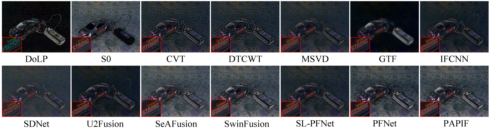
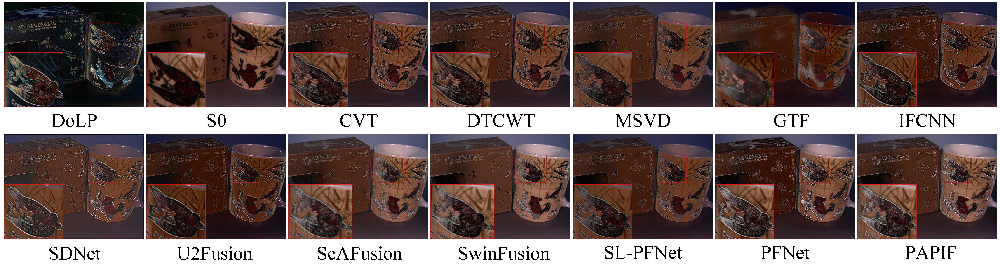
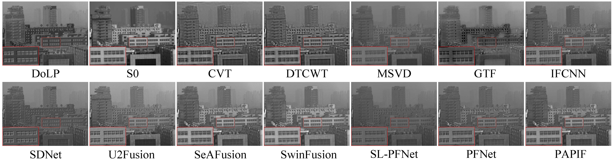

# PAPIF
Code of Attention-guided Polarization Image Fusion Using Salient Information Distribution

## Fused results:

## To train:
python train.py

## To test:
python test.py

## Tips:
### For training:
* [Training dataset](https://github.com/ymonno/EARI-Polarization-Demosaicking)

If you have any question, please email to me (ycsunner@gmail.com).
